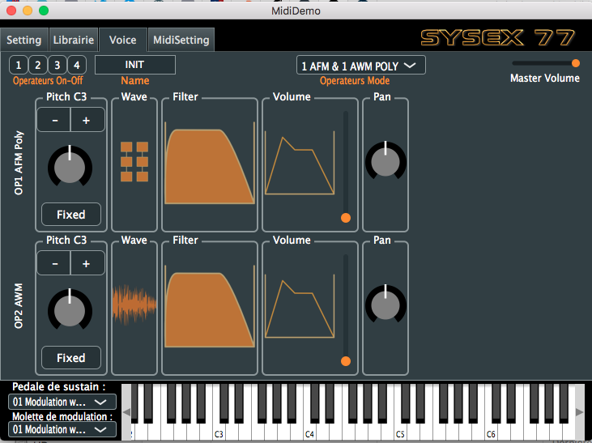

# Sysex77 midi editor for the Yamaha SY77

Be carreful, this is not a finalized app, use it at your own risk !

Attention cette version est en cours de développement, elle est loin d’être parfaitement fonctionnelle …
A utiliser avec precaution
OSX 10.7 minimum (Lion)

A l’ouverture, après l’image d’accueil, sélectionné votre interface midi, ensuite vous pouvez sur cette même page activer ou désactiver le bulk protect ou vous pouvez le faire sur votre synthé pour permettre les échanges de banques, attention cela peut éffacer vos patchs perso dans votre synthé, faite une sauvegarde !  

Cliquer en haut de la page ou dans une zone noire pour faire apparaitre le menu.

La librairie permet le dump de banques sonores, vous en trouverez un grand nombre sur le web au format .SYX
par exemple ici http://bobbyblues.recup.ch/yamaha_sy77/sy77_patches.html
Pensez a sauver vos banques au préalable et à désactiver le bulk protect…

Cette application est et restera libre, vous pouvez m’encourager simplement en écoutant un ou plusieurs de mes titres sur deezer/spotify etc. en recherchant "Sebastien Portrait" vous trouverez quelques titres comme "Ocean beach Club" 
Bien à vous,
Seb

Ps: Aucun animal n'a été blessé durant le developpement de cette application, bien au contraire un labrador à partager de nombreuses interrogations et l'agitation de son train arrière n'a laissé aucun doute "suis content" ! 
     
