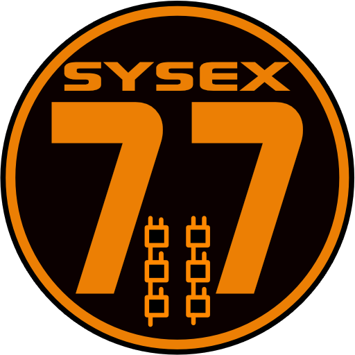
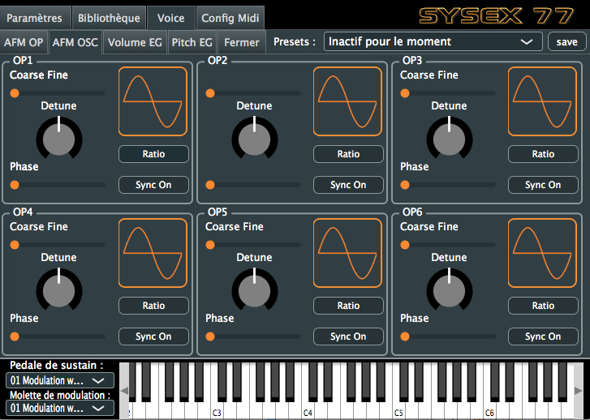

  # Sysex77 midi editor for the Yamaha SY77/99,  Editeur Midi pour le Yamaha SY77/99 (EN/FR)
  
  

#ENGLISH

Be carreful, this is not a finalized app, use it at your own risk !
When you open, after the home image, select your midi interface, then you can activate or deactivate the bulk protect on this same page or you can do it on your synth to allow bank exchanges, be careful it can delete your custom patches in your synth, make a backup !

Click at the top of the page or in a black area to bring up the menu.

The library allows you to dump sound banks, you will find a large number of them on the web in.SYX format

This application is and will remain free, you can encourage me by simply listening to one or more of my tracks on deezer/spotify etc. By searching for "Sebastien Portrait" you will find some titles like "Ocean beach Club". 
https://open.spotify.com/artist/3qPhbBJMJSF3AYbvzll5Zm?si=z6Rnq3ghR02R2sWc9b2mHg

*Ps: No animals were injured during the development of this application, on the contrary a labrador to share many questions and the agitation of his rear axle left no doubt "am happy"! 

*****************************************
#FRANCAIS

Attention cette version est en cours de développement, elle est loin d’être parfaitement fonctionnelle …
A utiliser avec precaution, Sysex77.app -> OSX 10.7 minimum (Lion) Sysex77 osx1012.app -> à partir de Sierra ...

A l’ouverture, après l’image d’accueil, sélectionné votre interface midi, ensuite vous pouvez sur cette même page activer ou désactiver le bulk protect ou vous pouvez le faire sur votre synthé pour permettre les échanges de banques, attention cela peut éffacer vos patchs perso dans votre synthé, faite une sauvegarde !  

*Si vous utilisez un SY99 choisissez SY99 dans les paramètres, fermez et rouvrez l'application.(la liste des waves correspondra à votre synthé).

Cliquer en haut de la page ou dans une zone noire pour faire apparaitre le menu.

La librairie permet le dump de banques sonores, vous en trouverez un grand nombre sur le web au format .SYX
par exemple ici http://bobbyblues.recup.ch/yamaha_sy77/sy77_patches.html
*Pensez a sauver vos banques au préalable et à désactiver le bulk protect…
    
   
   

Cette application est et restera libre, vous pouvez m’encourager simplement en écoutant un ou plusieurs de mes titres sur deezer/spotify etc. en recherchant "Sebastien Portrait" vous trouverez quelques titres comme "Ocean beach Club" 
https://open.spotify.com/artist/3qPhbBJMJSF3AYbvzll5Zm?si=z6Rnq3ghR02R2sWc9b2mHg
Bien à vous,
Seb

*Ps: Aucun animal n'a été blessé durant le developpement de cette application, bien au contraire un labrador à partager de nombreuses interrogations et l'agitation de son train arrière n'a laissé aucun doute "suis content" ! 

THANKS A LOT AT THE JUCE FORUM AND SPECIALLY:

# Daniel, Jules, McMartin, matkatmusic, Xenakios, dqthebt
Thank you for your patience and valuable help.

