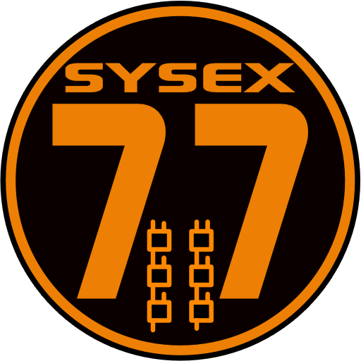
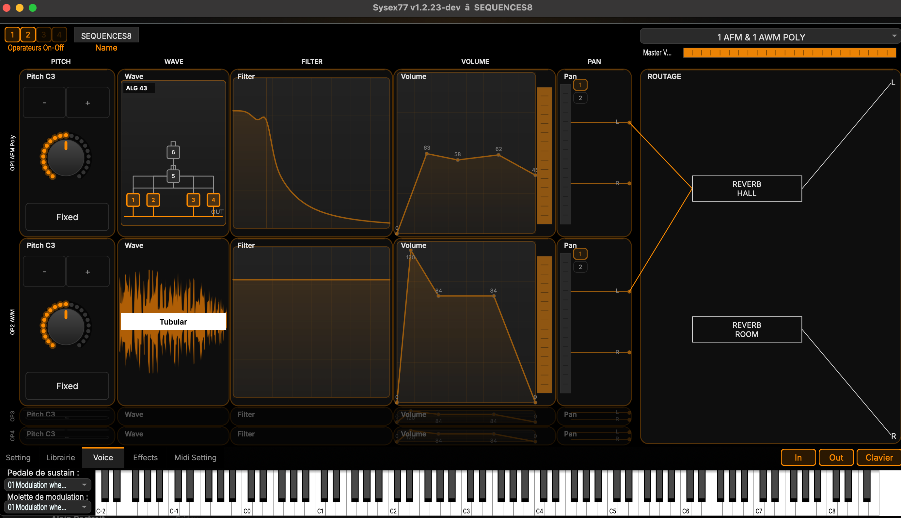
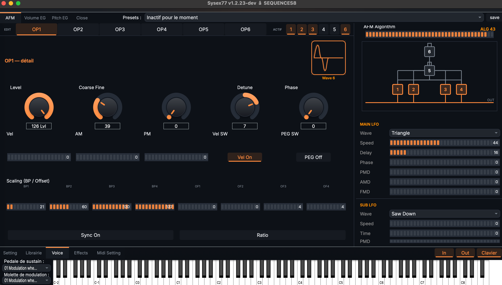

# Sysex77 — éditeur MIDI pour Yamaha SY77 / SY99 (EN / FR)



Éditeur de sysex (presets & banques) pour les Yamaha **SY77 / SY99 / TG77**, écrit en C++/JUCE.
Inspiré, côté fonctionnalités, de l'éditeur *SynthWorks SY77*.

> ⚠️ **Projet en cours de développement** — à utiliser avec précaution.
> L'envoi de banques peut **écraser les patchs de votre synthé** : faites une sauvegarde et
> désactivez le *bulk protect* au préalable.

**Contributions bienvenues** — quiconque souhaite contribuer, voire reprendre le projet, est le bienvenu.



---

## Fonctionnalités

- **Éditeur de voix** AFM / AWM : opérateurs, oscillateurs, filtres, enveloppes, pan.
- **Rendu de la forme d'onde FM** reproduisant la topologie réelle des **45 algorithmes** du SY77.
- **Édition à la souris des graphes** : glisser sur la réponse du **filtre** (cutoff/résonance) et
  sur les nœuds des **enveloppes** (niveau + rate) — vignettes d'élément et éditeurs complets.
- **Groupes de sortie** par élément reliés au schéma de **routage** (→ Reverb Hall / Room).
- **Onglet Effets** : Effect Mode + 2 unités Modulation + 2 unités Reverb.
- **Librairie de banques** (`.SYX`) : dump, et **ouverture d'un preset dans l'éditeur** par
  double-clic (envoi au synthé + bascule sur l'éditeur).
- **Persistance** des réglages : interfaces MIDI, device number, taille de fenêtre, onglet,
  clavier, et **couleurs personnalisées** (thème custom).
- Synchronisation **tout-MIDI** bidirectionnelle (un seul *device number* global).

> ⚠️ Certaines éditions (effets, groupes, enveloppes…) sont pour l'instant en **rendu/état seul**
> côté éditeur ; l'envoi sysex complet vers le synthé est en cours de fiabilisation.

---

## Lancer l'app pré-compilée (macOS)

L'application macOS pré-compilée est fournie dans **`dist/Sysex77.app`** (Apple Silicon / arm64).
Elle n'est **pas signée ni notariée** par Apple : au **premier lancement**, macOS la bloque
(« développeur non identifié »). Pour l'autoriser :

1. **Clic droit** (ou Ctrl-clic) sur `dist/Sysex77.app` → **Ouvrir** → puis, dans la boîte de
   dialogue, cliquez encore sur **Ouvrir**. *(Une seule fois ; ensuite, double-clic normal.)*
2. **Sans Terminal** (macOS récent) : double-cliquez l'app une fois (elle est bloquée), puis allez
   dans **Réglages Système → Confidentialité et sécurité** ; tout en bas, un message « Sysex77 a
   été bloqué… » propose **« Ouvrir quand même »** → cliquez, puis **rouvrez l'app** et confirmez.
3. *(Dernier recours, Terminal)* si l'app est dite « endommagée » après **téléchargement**
   (quarantaine), retirez l'attribut :
   ```bash
   xattr -dr com.apple.quarantine dist/Sysex77.app
   ```

> ⚠️ Binaire **Apple Silicon (arm64)** pour l'instant. Sur Mac **Intel** (ou en cas de doute),
> compilez depuis les sources (ci-dessous) — c'est tout aussi simple.

---

## Build (sans Projucer)

Compilation via CMake — **pas besoin de Projucer**, et **JUCE est téléchargé
automatiquement** s'il est absent. Idéal pour les utilisateurs **non-Mac** (l'app pré-compilée
n'est fournie que pour macOS).

```bash
./build.sh --test     # macOS / Linux
build.bat  --test     # Windows
```

📖 **Guide complet** (prérequis par OS, options, dépannage) : voir **[BUILD.md](BUILD.md)**.

---

## Utilisation

À l'ouverture (après l'image d'accueil) : sélectionnez votre interface MIDI, puis le **device
number (canal)** dans *Setting*. Vous pouvez y activer/désactiver le *bulk protect* (ou le faire
sur le synthé) pour autoriser les échanges de banques.

- **SY99** : choisissez *SY 99* dans les paramètres, fermez et rouvrez l'application (la liste des
  waves correspondra à votre synthé).
- Cliquez en haut de la page (ou dans une zone noire) pour faire apparaître le menu.
- La **Librairie** permet de dumper des banques. On en trouve beaucoup au format `.SYX`, par ex.
  http://bobbyblues.recup.ch/yamaha_sy77/sy77_patches.html
  *(Pensez à sauvegarder vos banques et à désactiver le bulk protect avant.)*
- **Double-cliquer une voix** de la librairie l'envoie au synthé **et l'ouvre dans l'éditeur**
  (bascule automatique sur l'onglet *Voice*).



---

## English (summary)

Sysex (presets & banks) editor for the Yamaha SY77/SY99/TG77, C++/JUCE.
**Not finalized — use at your own risk; sending banks can erase your synth's patches, back up first!**

Prebuilt macOS app: `dist/Sysex77.app` (Apple Silicon, **unsigned**). First launch: right-click →
Open → Open, or (recent macOS) System Settings → Privacy & Security → **Open Anyway** then reopen.
If "damaged" after download: `xattr -dr com.apple.quarantine dist/Sysex77.app`.

Build (no Projucer needed): `./build.sh` (macOS/Linux) or `cmake -B build && cmake --build build`
(Windows incl.). JUCE is auto-resolved (local `JUCE_DIR`, `/Applications/JUCE`, or auto-downloaded).
Run unit tests with `--test`.

On launch: pick your MIDI interface, then the device number (channel) in *Setting*; toggle bulk
protect to allow bank exchanges. The Library dumps sound banks (`.SYX`); double-clicking a voice
sends it to the synth and opens it in the editor.

Highlights: AFM/AWM voice editor, FM-waveform render of the real 45 algorithms, mouse-editable
filter & envelope graphs, output groups + routing, an Effects tab, and persistence of settings &
custom colours. Some edits are editor-state-only for now (full sysex send is being firmed up).

---

## Documentation de référence

- `SY77_PARAMETERS.md` — référence sysex (format, groupes, adresses) croisée code + spec officielle.
- La spec Yamaha *SY77 MIDI Data Format* et les captures SynthWorks sont sous `docs/` (non versionné).

## Soutien & remerciements

Cette application est et restera **libre**. Pour m'encourager : écoutez un de mes titres
(*Sebastien Portrait* sur Spotify/Deezer — ex. *Ocean Beach Club*).
https://open.spotify.com/artist/3qPhbBJMJSF3AYbvzll5Zm

Un grand merci au **forum JUCE**, en particulier : Daniel, Jules, McMartin, matkatmusic, Xenakios, dqthebt.

*Ps : aucun animal n'a été blessé durant le développement — au contraire, un labrador a partagé
de nombreuses interrogations, et l'agitation de son train arrière n'a laissé aucun doute : « suis content » !*

— Seb
